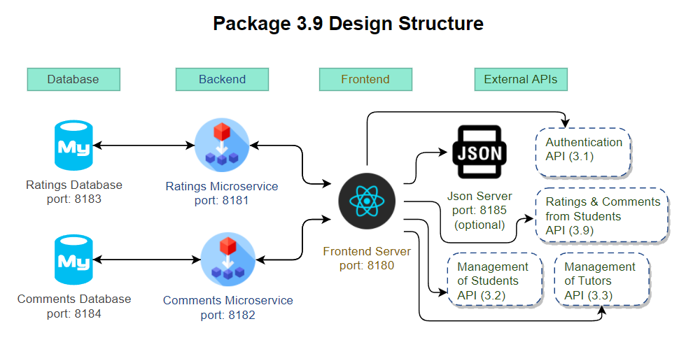
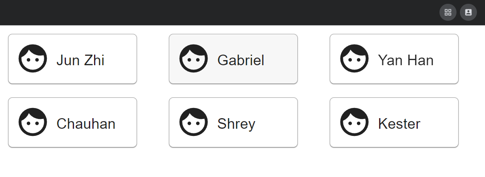
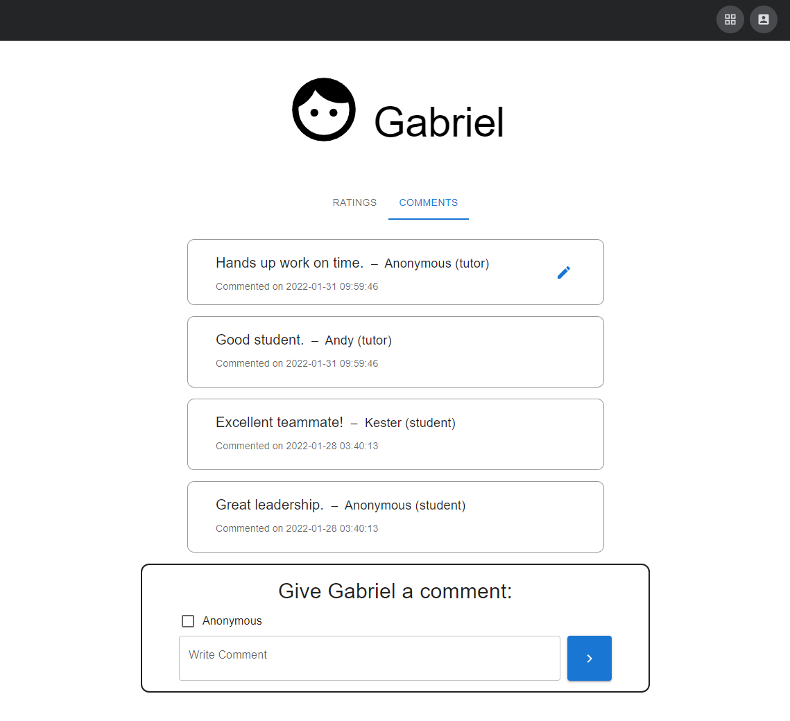
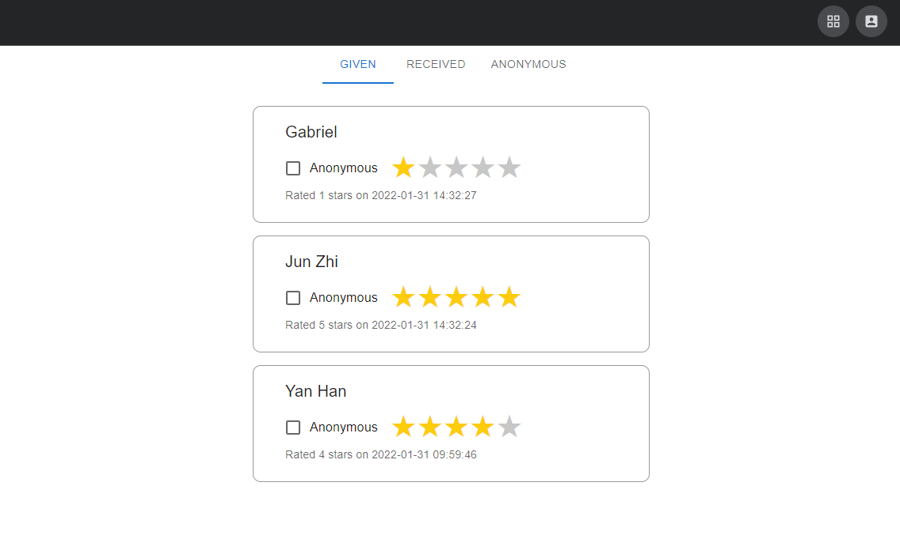

# ETI ASSIGNMENT 2 [Package 3.10]

## 1. Assignment 2 Description

EduFi is a monolith project split into several microservices, to demonstrate its architecture as well as REST APIs. A total of 23 different microservices and the one in this repository is **3.10. Rating and Comments Dashboard for Tutors**.

For this package, the chosen technology stack consists of:

- [Golang](https://go.dev/) for backend API server.
- [MySQL](https://www.mysql.com/) for database.
- [React](https://reactjs.org/) framework for frontend.
- [MUI](https://mui.com/) component library for frontend.
- [json-server](https://www.npmjs.com/package/json-server) for mocking students and tutors data.



**Docker Hub Links**

- [Ratings Microservice](https://hub.docker.com/repository/docker/echokes/18-rating_ms_image)
- [Ratings Database](https://hub.docker.com/repository/docker/echokes/18-rating_db_image)
- [Comments Microservice](https://hub.docker.com/repository/docker/echokes/18-comment_ms_image)
- [Comments Database](https://hub.docker.com/repository/docker/echokes/18-comment_db_image)
- [React Frontend](https://hub.docker.com/repository/docker/echokes/18-frontend_react_image)
- [Json Server](https://hub.docker.com/repository/docker/echokes/18-json_server_image)

**For an in-depth documentation of the API, please refer to the [API Reference](API_reference.md).**

The task breakdown for this assignment is as follows:

- 3.9.1. Create, view, update ratings and comments to students

- 3.9.2. View ratings and comments received

- 3.9.3. List ratings and comments received (anonymized)

- 3.9.4. List ratings and comments given

## 2. Frontend Webpage Routes

```sh
# 1. All students
http://10.31.11.11:8180/dashboard

# 2. Specific student feedback
http://10.31.11.11:8180/dashboard/:studentId

# 3. Personal ratings
http://10.31.11.11:8180/personal/ratings

# 4. Personal ratings
http://10.31.11.11:8180/personal/comments

```

Any non-matching routes will be brought to the Error Page.

## 3. Deployment Instructions

To deploy, either run docker commands or clone this repository to run docker compose commands.

**Clone Repository Method**

Clone the repo

```sh
git clone https://github.com/EchoKes/Assignment2.git
```

Build and fire the containers in detached mode (docker compose)

```sh
docker-compose up --build -d
```

Stop and remove containers (docker compose)

```sh
docker-compose down
```

## 4. Manual Setup Instructions

Installation Requirements:

- Golang
- MySQL
- Node Version 14.17.5 or above
- NPM Package Manager

### 4.1. Backend Start Up

In the Microservices directory (where multiple microservices are), cd into each individual folder and do `go run *.go` to start running the server. On successful setup, the server will be available on **port 8181** for ratings microservice and **port 8182** for comments microservice.

### 4.2. MySQL Database

Please ensure that MySQL is installed and operation on your device. In the Database directory (where multiple query files are) with a file named `ExecStartDB.sql`, execute this start script.

### 4.3. React Frontend Application

In the frontend directory, run `npm install` to download the relevant dependencies. Then, run `npm start` to serve the React application on **port 8180**.

### 4.4. Json Server Mock Data

In the frontend directory, run `json-server --watch db.json --port 8185` to serve the json-server on **port 8185**.

## 5. Design Considerations

### Backend Microservices

For this overall assignment, a total of 3 microservices were created, 2 for the backend API which serves API requests for both ratings and comments, and the other for the frontend server, which serves the React webapp. The reason why comments and ratings are split into 2 individual microservices is because in the event of a failure in one of the microservices, the other can still be served. As a result of this implementation, the functions in these 2 microservices are very similar.

### Database

The use of MySQL database was a choice between comfort and compatibility. In this case, comfort was the winner as more time was spent towards learning and implementing a new frontend framework. If more time was allocated for this assignment, a better choice would be to go with a lightweight, non-relational database design such as [Redis](https://redis.io/) or [MongoDB](https://www.mongodb.com/) as this package does not require any joins operation.

### Frontend Web Server

For the frontend, the chosen framework was React as it is component-based. The benefit of doing so is that certain parts of the frontend can reuse these components as some of them are repetitive. This has significantly reduce the amount of code needed to be written. Examples can be found in student's or tutor's ratings/comments with tab implementation. The use of states has made the web application much more enjoyable as users do not need to refresh to view changes made. Also, I wanted to take this chance to learn a new framework.







## Roadmap

- [ ] Implement Package 3.1 Authentication
- [ ] Implement Package 3.2 get students details
- [ ] Implement Package 3.3 get tutors details
- [ ] Implement Package 3.9 get students received ratings and comments

## Contact

Kester Yeo - [School Email](mailto:s10185261@connect.np.edu.sg)

Project Link: [https://github.com/EchoKes/Assignment2](https://github.com/EchoKes/Assignment2)
